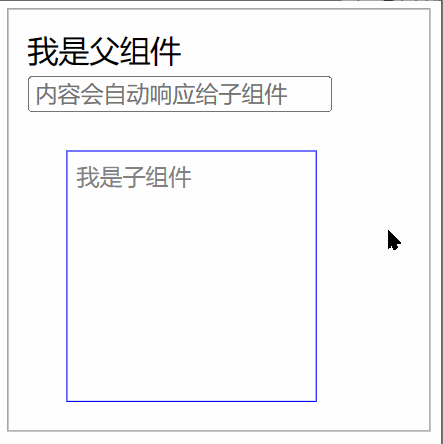

### 介绍

这是一个超级小（至少初衷是力求更小）的响应式前端开发框架。只有 4kb，zip后只有不到2kb。
支持功能：

1. 组件模块化。
2. 事件及自定义事件处理。
3. 响应式参数变化及data变化。

响应式并不会自动帮你更新界面上对应的内容，而是你可以通过 `watch` 你的data里的变量或者
props参数里的变量，在`watch`里你需要自己实现对界面的更新。为什么要这样做？因为如果要实
现自动更新界面，那么对比界面前后变化的代码将会是一笔不小的开销，自己实现针对需要更新的界面
代码将会带来更优的执行效率。

### 示例



先将本框架代码引入到你的页面中，你就可以开始模块开发了：

```html
<html>
<head>
    ...
    <script src="../dist/Baby.js"></script>
    ...
</head>
<body>
<div id="app"></div>
<script>

    let SubCom = {
        props: {word: {type: String}},
        render: function (h) {
            return h("div", {
                style: {
                    wordBreak: "break-all",
                    border: "1px solid blue",
                    margin: "20px",
                    width: "120px",
                    height: "120px",
                    padding: "5px"
                }
            }, [
                h("div", {style: {color: "gray", fontSize: "10px"}}, "我是子组件"),
                h("div", {ref: "content"}, this.word)
            ])
        },
        watch: {
            word(newval) {
                this.$refs.content.innerText = newval
            }
        }
    }

    let Main = {
        components: {SubCom: SubCom},
        render: function (h) {
            return h("div", {
                style: {
                    border: "1px solid gray",
                    width: "200px",
                    height: "200px",
                    padding: "10px"
                }
            }, [
                h("div", {}, "我是父组件"),
                h("input", {
                    ref: "input",
                    placeholder: "内容会自动响应给子组件",
                    style: {fontSize: "12px"},
                    on: {
                        input: this.onInput
                    }
                }),
                h("SubCom", {props: () => ({word: this.inputValue})})
            ])
        },
        methods: {
            onInput() {
                this.inputValue = this.$refs.input.value;
            }
        },
        data: {
            inputValue: ""
        }
    }

    new Baby(Main).$mount("#app");
</script>
</body>
</html>
```

### 入门使用

本框架的使用方式极大程度的借鉴了`vue`的组件编码方式，如果你对vue比较熟悉，那么对本框架的使用也会很快上手。

#### hello world

下面是一个非常简单的Hello World示例，通过这个示例你将了解到一个组件的基本代码样式。

```html
<div id="app"><div>
<script>
new Baby({
    render: function (h) {
        return h("div", {}, "Hello World.")
    }
}).$mount("#app");
</script>
```

其中最重要的是`render`函数，这个函数告诉框架该如何显示到界面上。这个函数和`vue`里面
render函数用法基本一致，对于其中`h`参数后面会进一步说明。

#### 组件参数

组件参数可以直接通过`props`进行声明：
```javascript
// 具有参数的子组件。
let SubComponent = {
    props: {
        username: {type:String}, // 定义 username 参数
    },
    render: function (h) {
        return h("div", {}, this.username)
    }
};

// 使用子组件并传递参数。
new Baby({
    components: {
        SubComponent: SubComponent
    },
    render: function (h) {
        return h("SubComponent", {props: {username: this.name}})
    },
    data: {
        name: "Jack"
    }
}).$mount("#app");
```

到目前为止看起来都和`vue`大差不差，但是要注意，这个示例代码存在一个问题，当父组件里面的
`name`变量改变后，子组件里里面的`username`其实并没有实时响应自动改变，如果想要实现子
组件也自动改变，那么在父组件中传入参数的形式就需要做一些修改。下面是一个示例：

```javascript
// 子组件依然使用上面的不变。
let SubComponent = {...}

// 父组件传入参数时须改为：
new Baby({
    ...,
    render: function (h) {
        return ("SubComponent", {
            props: () => ({username: this.name})
        })
    },
    ...
})
```

是的没错，只需要将原来通过对象直接赋值的形式，修改为现在以一个函数的形式的返回，就可以实现
父组件内的`name`变量在变化后自动将新值传递给子组件的`username`参数。此时在子组件中，
只需要通过watch参数`username`的变化即可实现实时更新。

#### 响应式

框架并不会通过响应式帮你自动更新界面上绘制的内容。但是框架支持监听各个变量或参数的变化，无论是
在当前组件中定义的变量，还是通过props参数传入的数据。通过`watch`都可以监听到它们的变化，比
如下面的示例：

```javascript
let SubComponent = {
    props: {
        time: {type:String},
    },
    render: function (h) {
        return h("div", {}, this.time)
    },
    watch: {
        time (newval, oldvalue) {
            // 在发现 time 字段更新时，进行页面内容的更新。
            this.$el.innerText = newval;
        }
    }
};

new Baby({
    components: {SubComponent},
    render: function (h) {
        return h("SubComponent", {
            props: () => ({time: this.currentTime})
        })
    },
    mounted () {
        // 每秒钟更新当前时间。
        setInterval(() => {
            this.currentTime = new Date().toLocaleString();
        }, 1000);
    },
    data:{
        currentTime: new Date().toLocaleString()
    }
}).$mount("#app");
```

框架目前可以监听到基本类型的变量或参数的值的变化，如果是对象或数组它们内部产生了变化，框架无法监听。

#### 完整组件

一个完整的组件如下：

```javascript
let Component = {
    name: "组件名称",
    components: {
        // 组件要使用的子组件定义。
    },
    render: function (h) { // 组件渲染函数，这个是必填项。
        return h("div", {}, "hello world.")
    },
    created () {
        // 组件被创建时调用，这时界面还没有显示。
    },
    mounted() {
        // 组件被渲染到界面后调用。
    },
    methods: {
        // 这里可以定义组件要使用的函数。
    },
    watch: {
        // 这里可以定义组件要监听哪些变量或参数。
    },
    data: {
        // 这里可以定义组件要使用的变量。
    }
}
```

#### 实例api

```javascript
this.$el // 获取组件的根dom。
this.$emit("事件名称", any) // 组件内发出事件。
this.$refs // 在render时通过ref标记的dom或组件都会被挂载到这上面。
this.$mount(selector) // 将组件挂载到html里指定选择器的位置,通常这个函数只在顶层组件调用。
this.$createElement(h) // 在组件内创建一个dom，这个函数的h和render函数的h是同样的用法。
```

#### 深入 render 函数

`render`函数要求返回一个dom，而传入的参数`h`其实就是一个帮助创建dom的创建工具。我们的重点在`h`函数上。
`h`函数有三个参数，它的定义如下：
```javascript
h(tagOrComponentName, option, childrenDom)
```
第一个参数是要创建的dom的tag名称，或者是子组件的组件定义名称。

第二个参数是创建时的配置选项，这个选项的详细含义如下：
```javascript
{
    on: {
        // 这里可以监听来自该dom或组件的各种事件。
    },
    props: {
        // 如果子组件需要参数，通过这里将参数传递给子组件。用这种写法时，子组件里的watch将监听不到参数值的变化。
    },
    props: () => ({
        // 如果子组件需要参数，通过这里将参数传递给子组件，用这种写法时，子组件可以同通过watch来监听参数变化。
    }),
    ref: "xxx", // 可以通过这个标记，然后在组件内使用 this.$refs.xxx 快速访问到该dom。
    style: {
        // 这里可以为dom设置样式，此处style的写法和dom原生style一样。
    },
    
    ... // 其它所有的更多的配置项，都将直接设置给当前创建的dom。
}
```

第三个参数是该组件的子组件定义。
